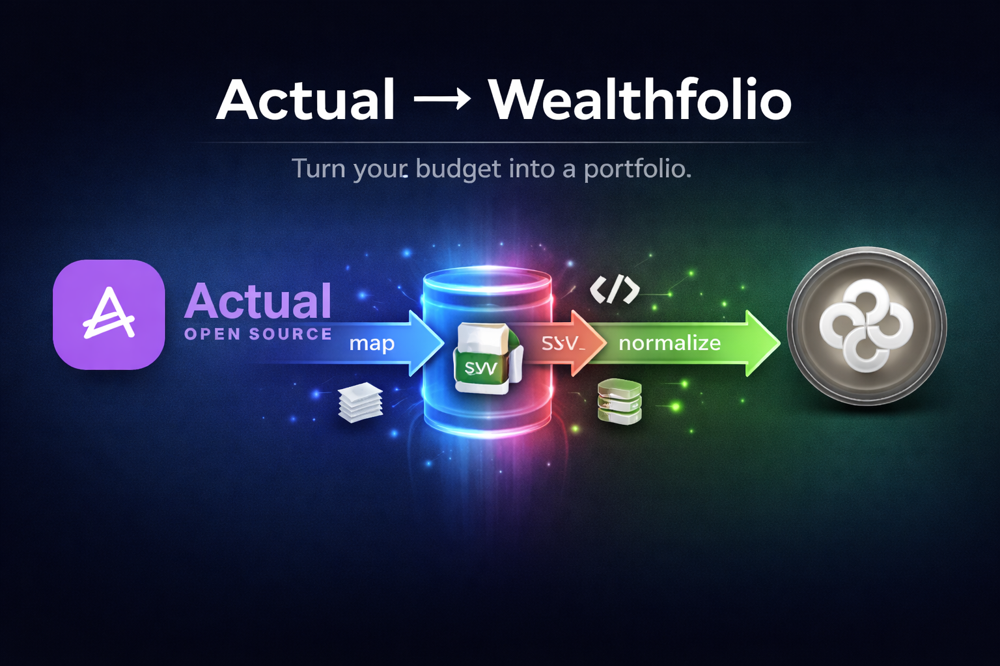

# Actual to Wealthfolio

[](https://github.com/franco-ruggeri/actual-to-wealthfolio/actions/workflows/ci.yml)
[](https://www.python.org/downloads/)
[](LICENSE)



## Overview

Convert Actual Budget CSV exports into Wealthfolio import files.

Actual Budget is the single source of truth. From Actual Budget transactions,
this tool generates transactions that can be imported in Wealthfolio.

## Motivation

You only want to add each transaction once and keep data in both apps.

Actual can synchronize transactions from bank accounts for free (for example,
via GoCardless), so a practical workflow is:

1. Sync transactions in Actual.
2. Sync Actual and Wealthfolio with this tool.

## Assumptions

### Categories

Actual categories are mapped to Wealthfolio categories with the following rules:

```text
stock purchases* => Buy
stock sales*     => Sell
dividends        => Dividend
interests        => Interest
income taxes     => Tax
banking fees     => Fee
```

Categories marked with `*` use **prefix matching**: any category whose name
starts with that prefix is matched.  This lets you use sub-categories such as
`Stock purchases - ERIC-B` or `Stock sales - AAPL` while still mapping them to
`Buy` and `Sell` respectively.

In Actual, make sure you name the categories with the left names. All the other
categories are mapped to `Withdrawal`, `Deposit`, `Transfer in`, and
`Transfer out`, depending on the amount and transaction type.

### Trade notes

For `stock purchases` (and sub-categories such as `stock purchases - ERIC-B`),
`stock sales` (and sub-categories), and `dividends`, the `Notes` field in
Actual must include trade annotations in this format:

- `Quantity: X; Unit price: Y`

Example:

- `Quantity: 10; Unit price: 123.45`

## Installation

```bash
pip install .
```

You can also use `uv`.

## Usage

1. For each budget file, go to _All accounts_ > three dots > _Export_.
2. Move the exported CSV files in `data` and name them
   `actual-<budget-file>.csv`, where `<budget-file>` is the name of the budget
   file.
3. Run:

   ```bash
   actual-to-wealthfolio
   ```

4. The converted CSV files are `output/wealthfolio-<account>-<budget-file>.csv`.
   There is one CSV file for each account.
5. Import the CSV files in Wealthfolio.

## Example input -> output

Example input row in `data/actual-main.csv`:

```csv
Date,Account,Payee,Notes,Category,Amount
2026-01-11,Brokerage,AAPL,"Quantity: 3; Unit price: 150.00",Stock purchases,-450.00
2026-01-11,Brokerage,ERIC-B,"Quantity: 100; Unit price: 9.50",Stock purchases - ERIC-B,-950.00
```

Example output rows in `output/wealthfolio-brokerage-main.csv`:

```csv
Date,Symbol,Comment,Type,Amount,Quantity,Unit_Price
2026-01-11,AAPL,"Quantity: 3; Unit price: 150.00",Buy,-450.00,3,150.00
2026-01-11,ERIC-B,"Quantity: 100; Unit price: 9.50",Buy,-950.00,100,9.50
```

## Architecture

### Directory Structure

```bash
.
├── README.md
├── pyproject.toml
├── data/
│   ├── actual-<budget-file>.csv
│   └── ...
├── output/
│   ├── wealthfolio-<account>-<budget-file>.csv
│   └── ...
│
└── src/actual_to_wealthfolio/
    ├── __main__.py                         # Enables python -m actual_to_wealthfolio
    ├── converter.py                        # CSV transformation logic
    └── main.py                             # CLI orchestration

```

### Data Flow

1. Load Actual transaction files matching `data/actual-<budget-file>.csv`
2. Convert each account to Wealthfolio format
3. Write `output/wealthfolio-<account>-<budget-file>.csv` for non-empty outputs
